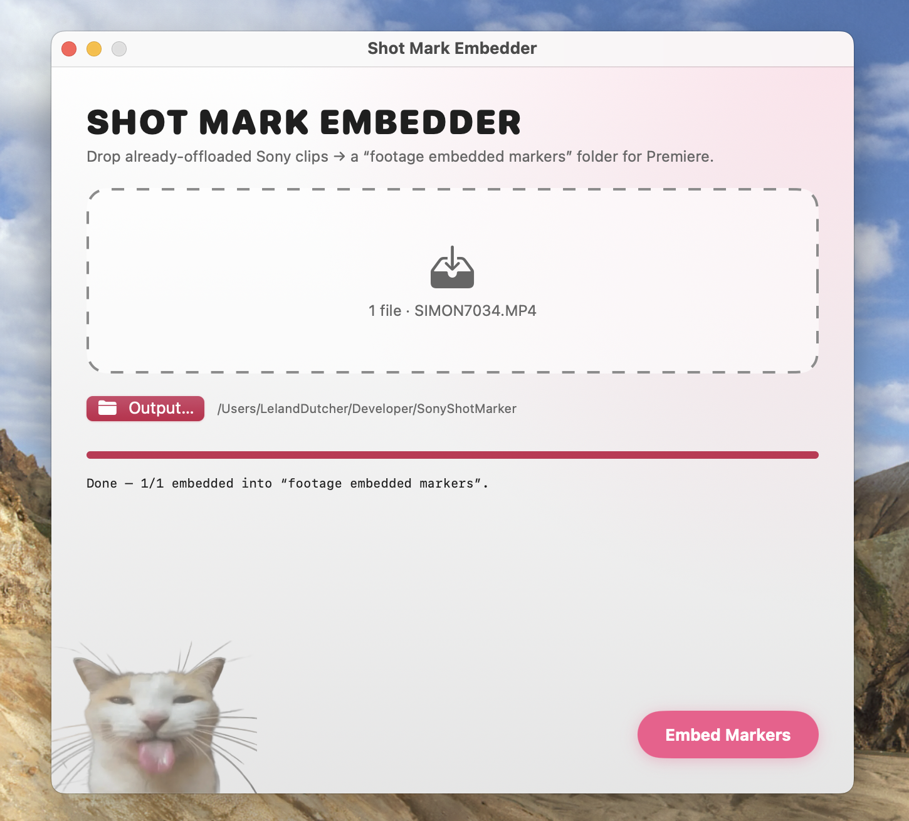
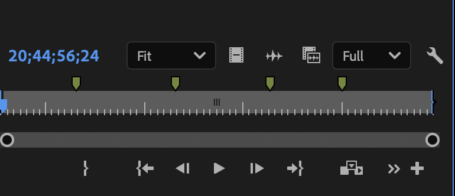
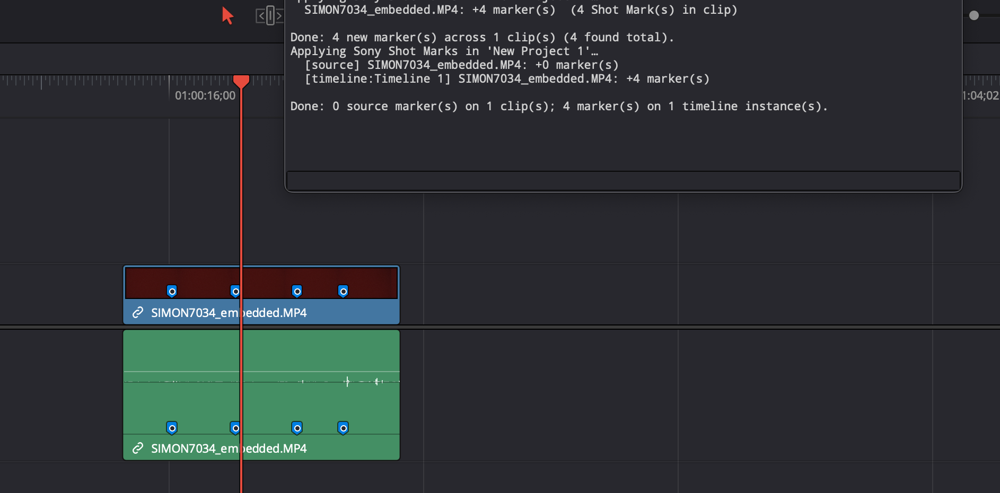

<div align="center">

# Shot Mark Embedder

### Turn Sony camera **Shot Marks** into real clip markers in **Premiere Pro** and **DaVinci Resolve** — for free, no plugin, no subscription, no watermark.

[](LICENSE)




</div>

---

Your Sony camera can drop frame-accurate markers *while you roll* — you hit the **C1** button mid-take, it flags the exact frame. It's one of the most underrated features on the A7S III / FX line. The problem? You get that footage into **Premiere** or **Resolve** and those marks just… vanish. The NLEs don't speak Sony's metadata, so the work you did on set evaporates the second you import.

**Shot Mark Embedder fixes that.** Drop your already-offloaded clips on it, and it reads the Shot Marks straight out of the camera's own metadata and bakes them into a copy of each file as standard Adobe XMP markers — the kind Premiere reads natively on import. No plugin to install, no Creative Cloud extension to babysit, no subscription, and no giant watermark stamped across your footage. The repo also ships a **DaVinci Resolve** script that drops the same marks in as Resolve clip markers.

## Table of contents

- [Why this exists (and why I didn't just pay Sony)](#why-this-exists-and-why-i-didnt-just-pay-sony)
- [What you get](#what-you-get)
- [Step 1 — Enable Shot Marks on your Sony camera](#step-1--enable-shot-marks-on-your-sony-camera)
- [Step 2 — The workflow](#step-2--the-workflow)
- [Premiere Pro](#premiere-pro)
- [DaVinci Resolve](#davinci-resolve)
- [Install](#install)
- [Supported cameras & formats](#supported-cameras--formats)
- [How it works](#how-it-works)
- [Build from source](#build-from-source)
- [⚠️ Read this before you delete originals](#️-read-this-before-you-delete-originals)
- [Disclaimer](#disclaimer)
- [License](#license)

## Why this exists

Sony *does* have an official answer: the **Catalyst Prepare Plugin** for Premiere Pro. I tried it. Here's the honest rundown:

- **It's paywalled by a watermark.** Get a clip into Premiere through the plugin and there's a **GIGANTIC watermark** burned across your footage unless you pay for Catalyst Prepare — call it **$100+/year**. So the "free" plugin is really a trial nag.
- **It's gated to specific Premiere versions.** Sony's plugin is a native MediaCore (C++) plugin that's only documented/compatible with a **narrow band of Premiere versions (roughly 15.4–22.4)**. Update Premiere and it breaks. It is effectively frozen in time.
- **It's not durable.** Because it's version-locked and machine-specific, it doesn't travel well — different editor, different Premiere build, different software stack, and you're troubleshooting a dead plugin instead of cutting.
- **It barely helps Resolve.** Sony's own docs note the Catalyst *Prepare Plugin for DaVinci Resolve* **can't import Shot Marks at all** — that lives only in the standalone Catalyst apps.

## What you get

| | |
|---|---|
| 🎬 **`Shot Mark Embedder.app`** | A tiny macOS app. Drag clips in → get a `footage embedded markers` folder of copies with the marks baked in. Read natively by Premiere Pro, Bridge, and Media Encoder on import. |
| 🪟 **Windows build** | A Windows port with the same framing and workflow lives in [`windows/`](windows/). It uses the same pure-Python marker engine and is built/tested by GitHub Actions. |
| 🟦 **`Resolve_ApplyShotMarks.py`** | A drop-in DaVinci Resolve script. One click in `Workspace ▸ Scripts` and every clip in your project gets its Shot Marks as Resolve clip markers — **including clips already cut into a timeline.** |
| 🧰 **The Python toolkit** | `sony_shotmark.py` (extract + translate to timecode → XMP / CSV / FCPXML / JSON) and batch tooling, if you'd rather script your own pipeline. |

Originals are **never modified** — the app only ever writes copies.

## Step 1 — Enable Shot Marks on your Sony camera

If you've never used Shot Marks, this is the on-set half. Map a button once and you'll never shoot without it again.

**Setup:**
> `MENU → Setup → Operation Customize → Custom Key/Dial Set` (for recording). Pick a button you like — the **C1** button or the **Shutter** button are great — and assign it to **"Add Shot Mark1"** (or **"Add Shot Mark2"** for a second flavor).

**In operation:**
> While the camera is rolling, **tap your assigned button.** It instantly drops a frame-accurate marker into the clip's metadata. Mark the take you liked, the moment the action happened, the keeper — whatever you'd otherwise be scrubbing for later.

`Shot Mark1` and `Shot Mark2` are two independent flags, so you can use them for two different meanings (e.g. *keeper* vs *cutaway*). This tool reads both.

## Step 2 — The workflow

This tool is one step in a real post pipeline — it is **not** an offload tool, and it should never be your only copy of anything.

1. **Shoot,** dropping Shot Marks with your mapped button.
2. **Offload your card properly first.** Use your normal validated/checksummed copy workflow (Hedge, Silverstack, [OpenLoupe](https://github.com/lelanddutcher/OpenLoupe), `rsync -c`, whatever you trust). Shot Mark Embedder assumes the footage is **already safely on disk**.
3. **Drop the offloaded clips** onto Shot Mark Embedder and pick an output location.
4. It writes a **`footage embedded markers/`** folder next to your chosen output — copies of each clip with the markers embedded. Your originals are untouched.
5. **Import the embedded copies** into Premiere (markers just appear), or run the Resolve script on your project.
6. **Verify** the markers landed and the clips play. *Then* — and only then — see [the warning below](#️-read-this-before-you-delete-originals) about originals.

## Premiere Pro

Import an embedded clip and the Shot Marks show up as clip markers, right where you dropped them on set. No plugin, no panel, no "Effect Controls → Source tab" scavenger hunt.

<div align="center">

<br><em>Four C1 Shot Marks, read straight from the embedded file — no plugin installed.</em>
</div>

> **Tip:** turn on **Preferences → Media → "Write clip markers to XMP"** so Premiere keeps treating these as first-class clip markers. And import the embedded copies into a fresh project / bin — Premiere caches clip metadata by file path, so if you previously imported the original it may show stale data.

## DaVinci Resolve

Resolve refuses to read markers out of a media file no matter how they're embedded — that's a Resolve limitation, not ours. So the repo includes **`Resolve_ApplyShotMarks.py`**, a self-contained drop-in script (no dependencies — pure Python standard library, runs in Resolve's built-in interpreter). It reads each clip's Sony Shot Marks straight from the file and applies them through Resolve's own scripting API.

<div align="center">

<br><em>The same four marks, applied as Resolve clip markers — on the source clip <strong>and</strong> on the clip already cut into the timeline.</em>
</div>

**Install:** copy `tools/Resolve_ApplyShotMarks.py` into Resolve's scripts folder:

- macOS: `~/Library/Application Support/Blackmagic Design/DaVinci Resolve/Fusion/Scripts/Utility/`
- Windows: `%APPDATA%\Blackmagic Design\DaVinci Resolve\Support\Fusion\Scripts\Utility\`

**Use:** import your footage, then run `Workspace ▸ Scripts ▸ Resolve_ApplyShotMarks`. It marks every clip in the Media Pool **and** every instance already edited into a timeline. It's idempotent — run it as many times as you want, it won't make duplicates. (You don't even need to run the embedder first for Resolve; the script reads the camera's marks directly.)

## Install

### The app

Grab the latest **`Shot Mark Embedder.app`** from [**Releases**](https://github.com/lelanddutcher/SonyShotMarker/releases), or [build it from source](#build-from-source). Drop clips, choose an output, hit **Embed Markers**. That's the whole app.

### The Resolve script

See [DaVinci Resolve](#davinci-resolve) above — it's one file, copied into one folder.

## Supported cameras & formats

Built and verified on the **Sony A7S III (ILCE-7SM3)** shooting **XAVC-I / XAVC-S / XAVC-HS** (4K, up to 4K120). Sony writes Shot Marks the same way across its modern XAVC bodies, so it should also work on the **FX3, FX30, FX6, A1, A7 IV** and similar — they all use the same `NonRealTimeMeta` metadata. If you've got a body that isn't reading correctly, open an issue with a sample clip's metadata and I'll take a look.

Marker embedding targets `.MP4` / `.MOV` (the QuickTime/ISO-BMFF containers); the Resolve script reads marks from those plus `.MXF`.

## How it works

Short version: Sony stores Shot Marks as **SMPTE KLV "essence marks"** inside a `NonRealTimeMeta` XML document that lives both embedded in the file and as the `Cxxxx M01.XML` sidecar. Each mark is a label (`_ShotMark1` / `_ShotMark2`) plus a frame count. The tool decodes the clip's start timecode from the packed-BCD LTC table, translates each mark to a frame-accurate timecode, and:

- **For Premiere:** writes the marks as Adobe Dynamic Media (`xmpDM`) markers into the file's reserved `free` space **before** the media data, exactly where Premiere looks for XMP. The media itself never moves, so the file stays valid — no re-wrap, no re-encode.
- **For Resolve:** hands the same frame positions to `MediaPoolItem.AddMarker()` / `TimelineItem.AddMarker()`.

The full reverse-engineering write-up (byte layout, the LTC decode, the KLV keys) is in [`docs/FINDINGS.md`](docs/FINDINGS.md), and the NLE-extensibility research is in [`docs/PREMIERE_PLUGIN.md`](docs/PREMIERE_PLUGIN.md).

## Build from source

### macOS app

```bash
git clone https://github.com/lelanddutcher/SonyShotMarker.git
cd SonyShotMarker/app
swift run                 # run it straight away, or…
bash build_app.sh         # → app/dist/Shot Mark Embedder.app
```

### Windows app

The Windows port lives in [`windows/`](windows/) and is built by `.github/workflows/windows-build.yml` on `windows-latest`. It matches the same basic flow: add/drop clips, choose output, click **Embed Markers**, and get copies in `footage embedded markers/`. The embedder is pure Python and does **not** require ExifTool.

```powershell
py -3.12 -m venv .venv-win
.\.venv-win\Scripts\Activate.ps1
python -m pip install --upgrade pip
python -m pip install -r requirements-windows.txt
python -m pytest -q tests
powershell -ExecutionPolicy Bypass -File windows\build_windows.ps1
```

Output: `dist\Shot Mark Embedder\Shot Mark Embedder.exe`.

Real Sony sample clips should still be used for final release validation on an actual Windows machine; the repo's synthetic fixtures prove parser/embedder mechanics and source-file safety.

Requires macOS 13+ and a Swift toolchain (Xcode or the Swift CLI). The Mac app is **pure Swift** — no Python, no ExifTool, no runtime dependencies. The Python tools in `tools/` are optional and only need Python 3.8+.

## ⚠️ Read this before you delete originals

This tool modifies files. It does that as carefully as possible — it writes **copies only**, it reuses reserved empty space in the container, and it never moves or re-encodes your actual video and audio. In testing it's been clean. But I'm going to be straight with you:

**Any tool that writes to a media file carries some nonzero risk of corruption.** It is exceedingly low here by design, but it is never exactly zero.

So treat it like the careful DIT you are:

1. Run the embed. Keep your originals exactly where they are.
2. **Import the embedded copies and actually watch them** — confirm they play start to finish, the audio's intact, and the markers are correct.
3. Only after you've verified the embedded copies are good — and you still have your originals backed up per your normal 3-2-1 — should you consider clearing the originals. **Never delete your only copy of anything because a piece of free software said "Done."**

## Disclaimer

> **No warranty. Use at your own risk.** Shot Mark Embedder is provided "as is," without warranty of any kind, express or implied. By using it you accept that you are solely responsible for your footage and your backups. **The author (Leland Dutcher) is not liable for any data loss, file corruption, lost footage, missed marks, or any other damages** arising from the use of this software, in any amount, under any circumstances. Always keep verified backups of your original camera files and do not delete them until you have independently confirmed the embedded copies are correct and intact. This software touches your media files; if that makes you nervous, don't use it on anything you can't afford to lose. See the [MIT License](LICENSE) for the full legal terms.

## License

[MIT](LICENSE) © 2026 Leland Dutcher. Do whatever you want with it; just don't blame me if it breaks.

---

<div align="center">
<sub>Built because losing on-set marks at import is dumb. Made with a tongue-out cat and a lot of reverse-engineering.</sub>
</div>
